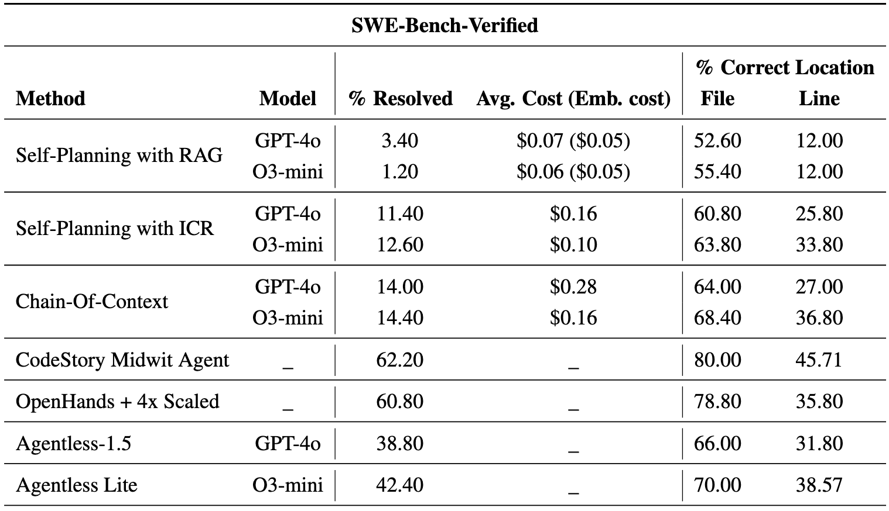

# Incorporating Chain-of-Context in Self-planning Enhances Interactive Code Generation from Natural Language

## Original Idea
The project is an implementation of the idea proposed for improved code generation in this doc - [Idea Doc](https://docs.google.com/document/d/1Plnxvgh7KfSnHrURyGp2fqXrZORDjQK-xc6rxZpnmU8/edit?tab=t.0)

## Usage

**Set API Keys**
Update `<open_ai_api_key>` and `<lang_smith_api_key>` in set_envs.sh

**Initialize environment**
```bash
poetry install
eval $(poetry env activate)
source set_envs.sh
```

**Load datasets**
```bash
python3 swe_bench.py --dataset_dir <director to save dataset> --split verified
python3 swe_bench.py --dataset_dir <director to save dataset> --split lite
```

**Run methods**
```bash
# Self-Planning with RAG
python3 agent_self_planning_rag.py --dataset_dir <path to directory containing dataset> --run_id <unique_run_id>

# Self-Planning with ICR
python3 agent_self_planning_icr.py --dataset_dir <path to directory containing dataset> --run_id <unique_run_id>

# Chain-Of-Context
python3 agent_coc.py --dataset_dir <path to directory containing dataset> --run_id <unique_run_id>
```

**Calculate coverage**
```bash
python3 coverage.py --pred <path to prediction file> --dataset_dir <path to directory containing dataset>
```

## Main Results

### SWE-Bench Verified


### SWE-Bench Lite


## Full Report
Read the [full report](https://www.overleaf.com/project/67cf2e8c2cea0064ada12be5)